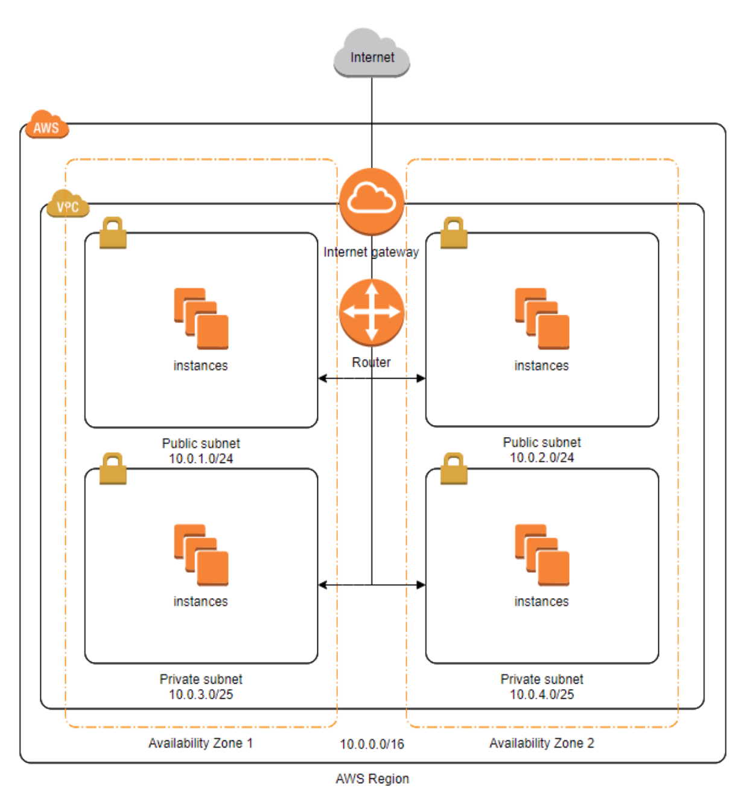

# 망 구성

### 통신망
- 노드들과 노드들을 연결하는 링크로 구성된 시스템이다(AWS로 따지면 Subnet).
- 노드란 IP로 식별 할 수 있는 대상이다(AWS로 따지면 EC2, RDS 등등).
- 링크란 물리적 회선이다.(통신망의 링크는 L2 Switch 이다.)
- [Switch 참고 링크](https://brainbackdoor.tistory.com/115)

### VPC
- 하나의 서비스를 위한 네트워크를 다루는 단위이다.
- VPC에는 서브넷과 라우팅 테이블, 인터넷 게이트웨이 등을 설정 할 수 있다.
- VPC는 사설 IP 대역으로 CIDR을 설정하고 생성한다.
- 하나의 Region 안에 VPC를 구성할 수 있다.
- 다수의 AZ 설정이 가능하다.

### Subnet
- 하나의 망이 Subnet 이다.
- VPC에서 설정한 사설 네트워크 대역을 더 세부적으로 나눈 네트워크이다.
- VPC의 CIDR 내에서 구성할 수 있다. -> 서브네팅

### 인터넷 통신
- 자신이 속한 subnet 끼리의 통신은 가상 스위치(L2 Switch)를 통해서 통신한다.
- 자신이 속하지 않은 subnet 끼리의 통신은 가상 라우터를 통해서 통신한다.
- 라우팅 테이블에게 그 외의 0.0.0.0/0 (전체 대역)에 대해서는 Internet Gateway로 통신을 보내도록 학습해야 한다.  
-> 그래야 외부 네트워크와 통신이 가능하다.(외부망에만 한정적인 소리)
- 외부 네트워크와 통신하기 위해서는 Public IP가 있어야 된다.

##### 그러면 Private Subnet(내부망)의 인스턴스들이 외부 네트워크와 통신하려면 어떻게 해야할 까?
- NAT Gateway를 사용해야한다.
- NAT의 역할 -> 간단히 얘기하자면 공통 Public IP를 가지고 Private Subnet(내부망)이 외부 네트워크와 통신할 수 있도록 해줌.
- Public Subnet(외부망)과 Private Subnet(내부망)의 라우팅 테이블 학습을 다르게 해야 한다.
##### Public Subnet의 라우팅
- Private IP외 의 전체 대역(0.0.0.0/0)에 대한 통신은 인터넷 게이트웨이로 가도록 학습
##### Private Subnet의 라우팅
- Private IP외 의 전체 대역(0.0.0.0/0)에 대한 통신은 NAT Gateway로 가도록 학습
- ex) EC2(내부망) -> NAT Gateway -> Internet Gateway -> 외부 네트워크 
