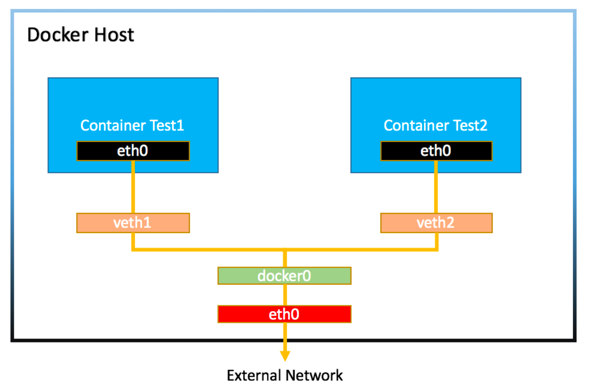

# 도커 네트워크

#### 그 전에..

##### veth interface
- 랜카드에 연결된 실제 네트워크 인터페이스가 아닌, 가상으로 생성한 네트워크 인터페이스이다.
- 일반적인 네트워크 인터페이스와는 달리 패킷을 전달받으면, 자신에게 연결된 다른 네트워크 인터페이스로 패킷을 보내주기 때문에 항상 쌍(pair)으로 생성해야 한다.

#### NET namespace
- 리눅스 격리 기술인 namespace 중 네트워크와 관련된 부분을 말한다.
- 네트워크 인터페이스를 각각 다른 namespace에 할당함으로써 서로가 서로를 모르게끔 설정할 수 있다.

### 도커 네트워크 구조
- 도커는 위의 veth interface와 NET namespace를 활용하여 네트워크를 구성한다.



- 컨테이너는 namespace로 격리되고 통신을 위한 네트워크 인터페이스(eth0)을 발급받는다.
- Docker host의 컨테이너와 1:1로 매칭되는 veth interface가 생성되고 컨테이너의 eth0과 연결된다.
- 위의 veth interface는 docker0이라는 다른 veth interface와 연결된다.
- docker0은 도커 실행 시 자동으로 생성되는 가상의 브릿지이다. 
- 모든 컨테이너는 이 브릿지를 통해 서로 통신이 가능하다.

```shell
## 도커를 처음 실행 했을 때 3가지 형태의 network가 생김을 확인할 수 있다.
## 컨테이너의 통신 방식에는 bridge, host, null이 있다.
## 컨테이너를 실행할 때 따로 설정 없을 시 default는 bridge 방식이다.
$ docker network ls
NETWORK ID          NAME                DRIVER              SCOPE
6b6ce553a425        bridge              bridge              local
81a18bc9cc40        host                host                local
576b0223f9cf        none                null                local

## bridge 네트워크를 확인해보면 172.17.0.0/16 대역을 할당했음을 확인할 수 있다.
$ docker network inspect bridge
[
    {
        "Name": "bridge",
        "Id": "6b6ce553a425c9392c5a65b8dcd2a57e1665289354b97f430758b745b1dc86a7",
        ...
                    "Subnet": "172.17.0.0/16",
                    "Gateway": "172.17.0.1"

## 그리고 172.17.0.0/16 대역은 docker0로 매핑되어 있다.
$ ip route
default via 192.168.0.193 dev eth0 proto dhcp src 192.168.0.207 metric 100
172.17.0.0/16 dev docker0 proto kernel scope link src 172.17.0.1

## docker0는 veth interface와 매핑된 브릿지임을 확인할 수 있다.
$ brctl show docker0
bridge name	bridge id		STP enabled	interfaces
docker0		8000.024238d4b0f5	no		vethc8e309f
```
- 여기서 docker-compose 없이, 이미지를 실행해서 컨테이너를 띄우면 그 컨테이너는 bridge 네트워크를 구성하고, docker0의 네트워크에 소속되게 된다.
- docker-compose로 컨테이너를 띄우면 다른 네트워크 대역을 가진다.(docker0 bridge를 사용하지 않고, 새로운 bridge를 생성한다.)
- 따라서 서로 경유하는 브릿지가 다르므로 docker-compose로 띄운 컨테이너와 이미지 실행해서 띄운 컨테이너는 통신이 불가능하다.
```shell
## 나의 개인 어플리케이션(gloddy_server)을 띄우는 docker-compose 명령이다.
$ docker-compose up -d

## gloddy_server_default라는 새로운 network가 생성된 것을 확인할 수 있다.
$ docker network ls
NETWORK ID     NAME                    DRIVER    SCOPE
3d15cc9aa14c   bridge                  bridge    local
0077828189f6   gloddy_server_default   bridge    local
40e270eec52b   host                    host      local
edf8fad78fa0   none                    null      local

## 이 네트워크는 172.18.0.0/16의 네트워크 대역을 가진다(docker0의 네트워크 대역과 다르다.)
$ docker network inspect 0077828189f6
[
    {
        "Name": "gloddy_server_default",
        "Id": "0077828189f6a0b47c89f190c0c6de11237cef4b7be54ddc504778b2e6a76d19",
        "Created": "2023-04-29T10:41:04.833974531Z",
        "Scope": "local",
        "Driver": "bridge",
        "EnableIPv6": false,
        "IPAM": {
            "Driver": "default",
            "Options": null,
            "Config": [
                {
                    "Subnet": "172.18.0.0/16",
                    "Gateway": "172.18.0.1"

## docker0의 veth interface를 사용하지 않고, 새로운 br-0077828189f6 veth interface를 사용한다.
$ ip route
default via 172.31.32.1 dev ens5 proto dhcp src 172.31.39.19 metric 100 
172.17.0.0/16 dev docker0 proto kernel scope link src 172.17.0.1 linkdown 
172.18.0.0/16 dev br-0077828189f6 proto kernel scope link src 172.18.0.1 
172.31.32.0/20 dev ens5 proto kernel scope link src 172.31.39.19 
172.31.32.1 dev ens5 proto dhcp scope link src 172.31.39.19 metric 100                 
```
- 위에서 gloddy_server_default라고 새로운 network(bridge)가 생성되었다.
- 이는 docker-compose로 올린 컨테이너가 사용하는 네트워크이다.
- docker 컨테이너를 띄울 때 네트워크를 구성하는 방법으로는 bridge 방법 외에 host, container, none 등 총 4개가 존재한다. 자세한 내용은 [링크](https://bluese05.tistory.com/38)를 참조

### 만약 docker-compose 파일 2개로 컨테이너 두개를 띄우고 두개의 컨테이너를 연결하려면 어떻게 해야할까?
- network를 생성한다.
- 각각 docker-compose 파일에 위의 생성한 network를 가지도록 설정한다.

### 포트 포워딩
- 기본적으로 컨테이너는 외부와 통신이 불가능하다.
- 포트포워딩을 통해 외부에 컨테이너를 공개할 수 있다.

```shell
# 포트포워딩 설정과 함께 컨테이너를 생성합니다.
$ docker container run -d -p 8081:80 nginx
16cd67c48e5721a6b666192b8960875c720168bf6c5e3ed2138fb04c492447c6
```
- -d 백그라운드 실행
- -p옵션을 통해 포트포워딩

  
